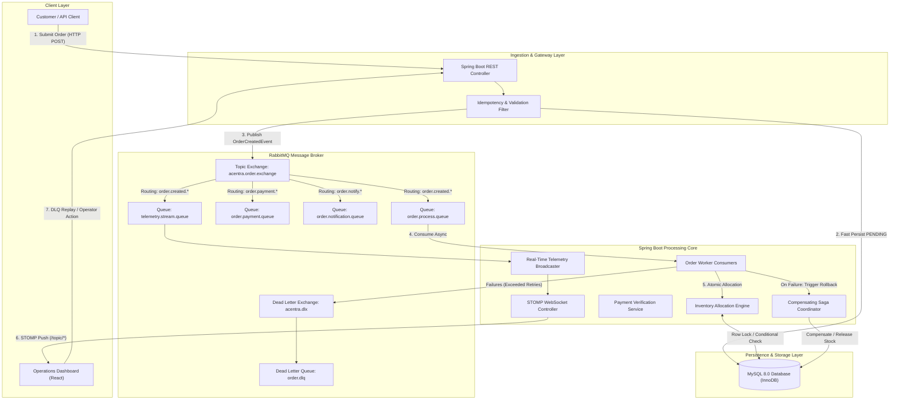
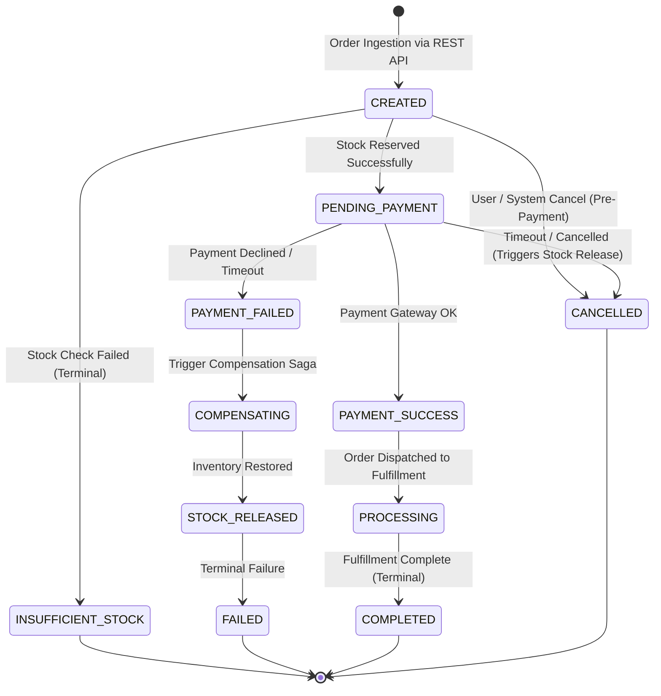
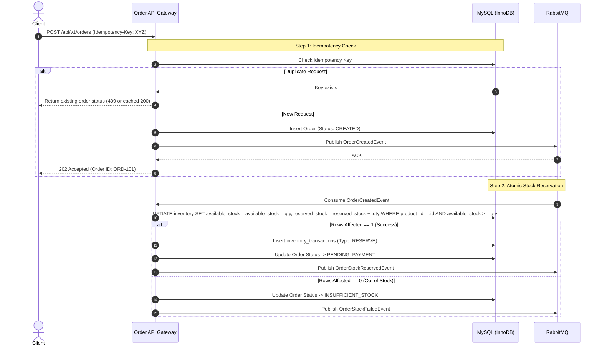
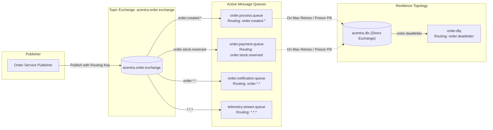
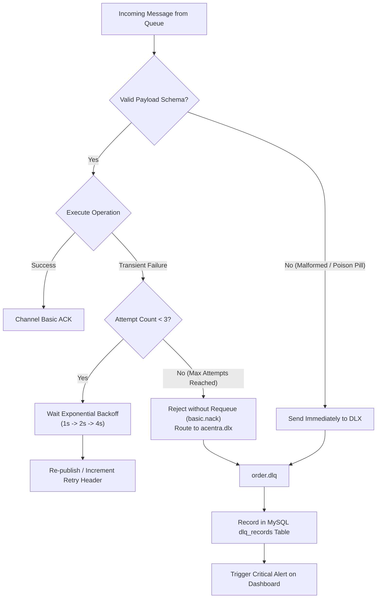
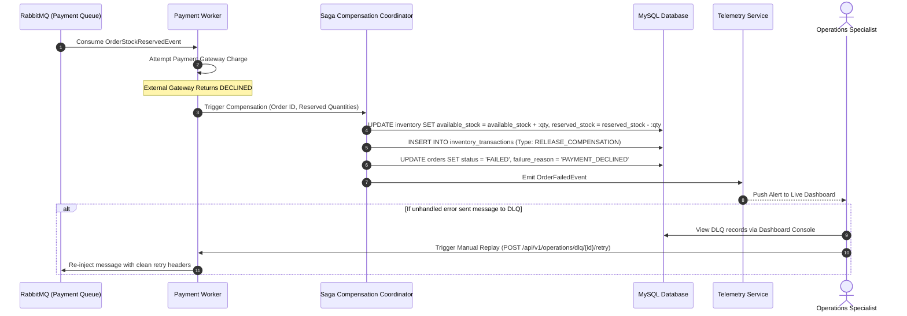
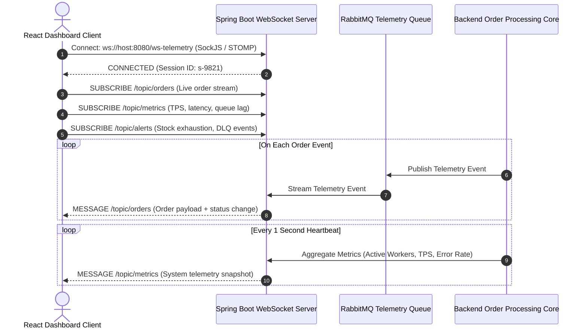
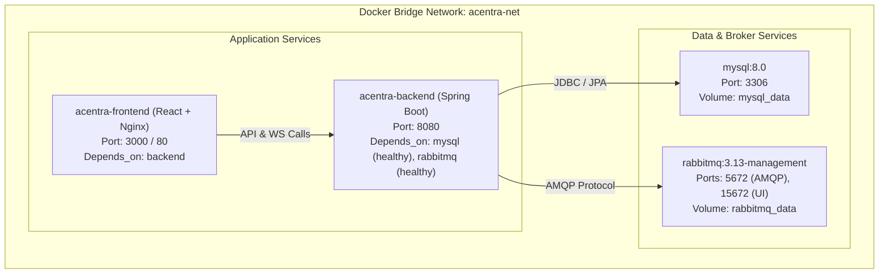

# System Architecture Specification - Shakthi-Acentra Order Processing System

---

## 1. Executive Summary & Overall System Architecture

The **Shakthi-Acentra Order Processing System** is designed as a high-throughput, fault-tolerant, and event-driven micro-architecture. It decouples high-velocity order intake from heavy transactional downstream operations (inventory reservation, payment verification, and fulfillment packaging) through an enterprise-grade message broker (**RabbitMQ**) and a resilient **Spring Boot** processing engine, while streaming sub-second telemetry to an interactive **React** operations dashboard over **WebSocket/STOMP**.

### High-Level Architecture Diagram



---

## 2. Major Backend Modules and Responsibilities

The backend is modularized to ensure clean separation of concerns, high maintainability, and horizontal scalability:

| Module | Core Responsibilities |
| :--- | :--- |
| **`com.acentra.order`** | Receives order requests, validates payload integrity, generates idempotency tokens, records initial `PENDING` order records, and coordinates state transitions. |
| **`com.acentra.inventory`** | Manages stock quantities, applies strict concurrency controls to prevent overselling, executes atomic reservation deductions, and releases reserved stock upon order cancellation or payment failure. |
| **`com.acentra.messaging`** | Encapsulates AMQP configurations, exchanges, queues, bindings, message publishers, message converters, and consumer listeners. |
| **`com.acentra.payment`** | Simulates and processes transactional payment verifications, handles external gateway timeouts, and emits success or failure events. |
| **`com.acentra.recovery`** | Monitors Dead Letter Queues (DLQ), logs poison-pill anomalies, manages retry backoff schedules, and exposes APIs for manual or automated message replay. |
| **`com.acentra.telemetry`** | Aggregates system metrics (throughput TPS, queue depth, error rates, processing latency) and broadcasts updates to WebSocket topics. |
| **`com.acentra.common`** | Houses shared domain models, custom exceptions, global error handlers, API response wrappers, and utility functions. |

---

## 3. Order Lifecycle State Machine

An order traverses discrete, auditable states with deterministic transitions. Every state change produces an immutable audit record and an asynchronous telemetry event.



### State Transitions & Description:
1. **`CREATED`**: Order recorded in the database with initial payload. Dispatched to `order.process.queue`.
2. **`PENDING_PAYMENT`**: Concurrency guard successfully deducted and reserved stock. Dispatched to payment queue.
3. **`INSUFFICIENT_STOCK`**: Stock allocation rejected. Order terminated without charging customer.
4. **`PAYMENT_SUCCESS`**: Funds captured. Dispatched to fulfillment pipeline.
5. **`PAYMENT_FAILED`**: Gateway error or card rejection. Triggers asynchronous compensating saga to return stock.
6. **`PROCESSING`**: Warehouse fulfillment packaging.
7. **`COMPLETED`**: Order fulfilled and shipped.
8. **`CANCELLED`**: Cancelled by operator or client; all held resources released.
9. **`FAILED`**: Terminal state for unrecoverable errors after DLQ routing.

---

## 4. Inventory Allocation & Concurrency Strategy (Zero Overselling)

Preventing inventory race conditions under heavy concurrent workloads is a fundamental design goal. Shakthi-Acentra implements a **hybrid defense-in-depth concurrency model**:



### Prevention Mechanism:
1. **Atomic Conditional SQL Update**:
   ```sql
   UPDATE inventory 
   SET available_stock = available_stock - :requestedQuantity,
       reserved_stock  = reserved_stock + :requestedQuantity,
       version         = version + 1
   WHERE product_id = :productId 
     AND available_stock >= :requestedQuantity;
   ```
   - **Why this works**: MySQL InnoDB executes row-level write locks on the matching index row during an `UPDATE`. Because the condition `available_stock >= :requestedQuantity` is evaluated inside the atomic database lock, multiple parallel threads cannot simultaneously over-allocate. If the stock is insufficient, the statement affects `0` rows, signaling immediate stock failure without deadlocks.
2. **Pessimistic Locking as Fallback for Multi-Item Bundles**:
   - For multi-item shopping carts where multiple products must be locked simultaneously, rows are locked in canonical order (`ORDER BY product_id ASC`) using `SELECT ... FOR UPDATE` to avoid circular deadlocks.
3. **Optimistic Locking (`@Version`)**:
   - The `inventory` table maintains a `version` column. Concurrent administrative restocks or price updates do not overwrite transactional inventory states.
4. **Idempotency Keys**:
   - Every order submission requires a client-generated UUID in `Idempotency-Key`. Duplicate network retries from users or client timeouts will return the existing order without repeating stock deduction.

---

## 5. RabbitMQ Event / Message Flow and Queue Design

Shakthi-Acentra uses a dedicated topic exchange model to achieve loose coupling, selective routing, and broadcast capabilities:



### Queue Topology Definitions:
- **Exchange**: `acentra.order.exchange` (Type: `topic`, Durable: `true`)
- **Queues**:
  1. `order.process.queue`: Handles stock deduction and initial validation. Configured with `x-dead-letter-exchange: acentra.dlx` and `x-dead-letter-routing-key: order.deadletter`.
  2. `order.payment.queue`: Handles payment processing and communication with payment service. Also bound to `acentra.dlx`.
  3. `order.notification.queue`: Handles email/SMS customer alerts.
  4. `telemetry.stream.queue`: Fast in-memory telemetry queue consumed by the WebSocket broadcaster.
  5. `order.dlq`: Parking lot for unprocessable messages requiring manual or automated intervention.

---

## 6. Retry & Dead Letter Queue (DLQ) Strategy

Transient failures (network blips, intermittent DB timeouts) are isolated from terminal failures (malformed JSON, invalid account numbers):



### DLQ Policies:
- **Max Retries**: 3 attempts before dead-lettering.
- **Backoff Algorithm**: Exponential with jitter ($t = initial \times 2^{attempt} \pm random\_jitter$).
- **Poison Pill Protection**: Deserialization or validation failures bypass retries and route directly to the DLQ to prevent blocking the queue.
- **Audit Persistence**: Dead-lettered messages are mirrored into the database `dlq_records` table with the original payload, failure timestamp, error stacktrace, and headers.

---

## 7. Failure Recovery Flow (Saga Compensation & Manual Replay)

When an order fails downstream (e.g. payment authorization rejected or gateway timeout), the system executes a **Compensating Transaction (Saga Pattern)** to return the reserved inventory:



---

## 8. Real-Time Dashboard Data Flow using WebSocket / STOMP

The operations dashboard requires real-time telemetry updates without browser polling:



### STOMP Topics Overview:
- `/topic/orders`: Emits real-time order creation, status transitions, and completion events.
- `/topic/metrics`: Broadcasts computed operational metrics (throughput TPS, average processing time, queue depth).
- `/topic/inventory`: Broadcasts low-stock alerts and out-of-stock notices.
- `/topic/alerts`: Pushes high-severity alerts (DLQ additions, payment gateway latency warnings).

---

## 9. Frontend Module Architecture (React)

The frontend is structured into cleanly isolated feature slices, custom hooks, and telemetry clients:

```
frontend/
├── public/
├── src/
│   ├── assets/              # Icons, logos, and visual assets
│   ├── components/          # Reusable design system components
│   │   ├── common/          # Buttons, Cards, Modals, Badges, Tables
│   │   ├── layout/          # Navbar, Sidebar, PageContainer, Header
│   │   └── widgets/         # TelemetryGauge, SparklineChart, LiveIndicator
│   ├── features/            # Domain-driven feature modules
│   │   ├── dashboard/       # Main Overview, KPI summary cards, throughput graphs
│   │   ├── orders/          # Live Order Stream, Order Detail Modal, Filter bar
│   │   ├── inventory/       # Stock Level Monitor, Low Stock Alerts, Restock UI
│   │   ├── dlq/             # Dead Letter Queue console, Replay & Purge actions
│   │   └── metrics/         # Latency percentiles (p50, p95, p99), Queue lag
│   ├── hooks/               # Custom React hooks
│   │   ├── useWebSocket.js  # STOMP/SockJS subscription and reconnect lifecycle
│   │   ├── useOrders.js     # Order data fetching and state aggregation
│   │   └── useMetrics.js    # Metric streaming and time-series rollups
│   ├── services/            # API clients & STOMP configuration
│   │   ├── api.js           # Axios instance with auth/error interceptors
│   │   ├── orderService.js  # REST calls for orders
│   │   ├── dlqService.js    # REST calls for DLQ inspections and replays
│   │   └── stompClient.js   # STOMP over SockJS setup and topic subscriptions
│   ├── context/             # Global telemetry & theme context
│   ├── types/               # TypeScript declarations or PropTypes contracts
│   ├── App.jsx              # Application router and shell
│   └── main.jsx             # Entry point with providers
```

---

## 10. Docker Service Architecture

The system is orchestrated into four isolated, networked containers:



### Container Specifications:
1. **`acentra-mysql`**: MySQL 8.0 with InnoDB, pre-configured database schema, and healthcheck verifying `mysqladmin ping`.
2. **`acentra-rabbitmq`**: RabbitMQ with management plugin, predefined credentials, and healthcheck checking `rabbitmq-diagnostics -q ping`.
3. **`acentra-backend`**: Multi-stage Dockerfile packaging the Spring Boot executable JAR; uses wait-for-health dependencies.
4. **`acentra-frontend`**: Multi-stage build producing static React assets hosted via an optimized Nginx container with API reverse-proxying.

---

## 11. Feature Classification: Baseline vs. Innovative Features

| Component / Capability | Baseline Functionality | Innovative Shakthi-Acentra Feature |
| :--- | :---: | :---: |
| **Order Intake** | Synchronous REST API with direct database insert | **Non-blocking ingestion with Idempotency Key validation & immediate 202 Accepted response** |
| **Inventory Management** | Naive `SELECT stock` followed by `UPDATE stock` (prone to race conditions) | **Atomic Conditional Deduction with Row-Locking & zero-overselling guarantee** |
| **Task Processing** | In-memory thread pools or synchronous blocking execution | **Decoupled RabbitMQ Topic Exchange pipeline with dedicated consumer worker pools** |
| **Failure Handling** | Database rollback or unhandled exceptions | **Automated Compensating Transactions (Saga) releasing stock on downstream payment failure** |
| **Error Handling** | Generic server errors / silent drops | **Multi-tier Retry Backoff with automated Dead Letter Queue (DLQ) isolation** |
| **Operator Tooling** | Direct database inspection via SQL queries | **Live DLQ Operations Console with one-click message replay & anomaly diagnosis** |
| **Operations Monitoring** | Polling REST APIs every few seconds | **Sub-second STOMP/WebSocket Telemetry streaming TPS, latency percentiles, and queue lag** |
| **Dynamic Prioritization** | First-Come First-Served FIFO queues | **High-Priority Queue Bypass routing for VIP/Express orders** |
