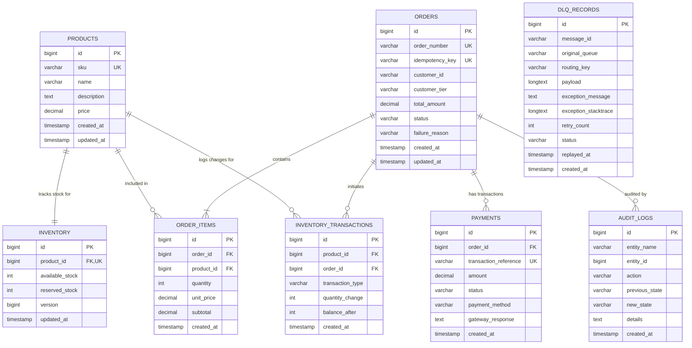

# MySQL Database Design & Schema Specification

---

## 1. Overview and Relational Strategy

The **Shakthi-Acentra** database is built upon **MySQL 8.0** using the **InnoDB** storage engine. InnoDB guarantees strict ACID compliance, row-level locking for high-concurrency inventory operations, and referential integrity through foreign key constraints.

### Entity Relationship Diagram (ERD)

---

## 2. Table Schemas, Constraints & Indexes

### 2.1 `products` Table
Stores product catalog data and pricing.

| Column | Data Type | Modifiers | Description |
| :--- | :--- | :--- | :--- |
| `id` | `BIGINT` | `AUTO_INCREMENT`, `PRIMARY KEY` | Unique product identifier |
| `sku` | `VARCHAR(64)` | `NOT NULL`, `UNIQUE` | Stock Keeping Unit code |
| `name` | `VARCHAR(255)` | `NOT NULL` | Product display name |
| `description` | `TEXT` | `NULL` | Detailed product description |
| `price` | `DECIMAL(12,2)` | `NOT NULL` | Unit retail price |
| `created_at` | `TIMESTAMP` | `DEFAULT CURRENT_TIMESTAMP` | Record creation timestamp |
| `updated_at` | `TIMESTAMP` | `DEFAULT CURRENT_TIMESTAMP ON UPDATE CURRENT_TIMESTAMP` | Last updated timestamp |

- **Indexes**:
  - `PRIMARY KEY (id)`
  - `UNIQUE KEY uk_products_sku (sku)`
  - `INDEX idx_products_name (name)`

---

### 2.2 `inventory` Table
Critical table managing available vs. reserved stock with row-level locks and optimistic concurrency control.

| Column | Data Type | Modifiers | Description |
| :--- | :--- | :--- | :--- |
| `id` | `BIGINT` | `AUTO_INCREMENT`, `PRIMARY KEY` | Unique inventory record identifier |
| `product_id` | `BIGINT` | `NOT NULL`, `UNIQUE`, `FK` | Foreign key referencing `products(id)` |
| `available_stock` | `INT` | `NOT NULL`, `DEFAULT 0` | Available stock eligible for new reservations |
| `reserved_stock` | `INT` | `NOT NULL`, `DEFAULT 0` | Stock temporarily held for pending payments |
| `version` | `BIGINT` | `NOT NULL`, `DEFAULT 0` | Optimistic locking version token |
| `updated_at` | `TIMESTAMP` | `DEFAULT CURRENT_TIMESTAMP ON UPDATE CURRENT_TIMESTAMP` | Last updated timestamp |

- **Constraints**:
  - `FOREIGN KEY (product_id) REFERENCES products(id) ON DELETE CASCADE`
  - `CHECK (available_stock >= 0)` (Enforces zero-overselling constraint)
  - `CHECK (reserved_stock >= 0)`
- **Indexes**:
  - `PRIMARY KEY (id)`
  - `UNIQUE KEY uk_inventory_product (product_id)`

---

### 2.3 `orders` Table
Master transactional order record containing current lifecycle status and metadata.

| Column | Data Type | Modifiers | Description |
| :--- | :--- | :--- | :--- |
| `id` | `BIGINT` | `AUTO_INCREMENT`, `PRIMARY KEY` | Internal surrogate primary key |
| `order_number` | `VARCHAR(64)` | `NOT NULL`, `UNIQUE` | Business identifier (e.g. `ORD-2026-0922-001`) |
| `idempotency_key` | `VARCHAR(128)` | `NOT NULL`, `UNIQUE` | Client-provided key preventing duplicate intake |
| `customer_id` | `VARCHAR(64)` | `NOT NULL` | Customer identifier |
| `customer_tier` | `ENUM('STANDARD', 'VIP', 'PRIORITY')` | `NOT NULL`, `DEFAULT 'STANDARD'` | Priority tier for routing |
| `total_amount` | `DECIMAL(12,2)` | `NOT NULL` | Total order valuation |
| `status` | `ENUM('CREATED', 'PENDING_PAYMENT', 'PAYMENT_SUCCESS', 'PAYMENT_FAILED', 'INSUFFICIENT_STOCK', 'PROCESSING', 'COMPLETED', 'CANCELLED', 'FAILED')` | `NOT NULL` | Current order state machine status |
| `failure_reason` | `VARCHAR(255)` | `NULL` | Human-readable explanation if failed |
| `created_at` | `TIMESTAMP` | `DEFAULT CURRENT_TIMESTAMP` | Ingestion timestamp |
| `updated_at` | `TIMESTAMP` | `DEFAULT CURRENT_TIMESTAMP ON UPDATE CURRENT_TIMESTAMP` | Status change timestamp |

- **Indexes**:
  - `PRIMARY KEY (id)`
  - `UNIQUE KEY uk_orders_order_number (order_number)`
  - `UNIQUE KEY uk_orders_idempotency_key (idempotency_key)`
  - `INDEX idx_orders_status_created (status, created_at)` (High-performance query for dashboard lists)
  - `INDEX idx_orders_customer (customer_id)`

---

### 2.4 `order_items` Table
Line items associated with an order.

| Column | Data Type | Modifiers | Description |
| :--- | :--- | :--- | :--- |
| `id` | `BIGINT` | `AUTO_INCREMENT`, `PRIMARY KEY` | Line item surrogate primary key |
| `order_id` | `BIGINT` | `NOT NULL`, `FK` | Foreign key referencing `orders(id)` |
| `product_id` | `BIGINT` | `NOT NULL`, `FK` | Foreign key referencing `products(id)` |
| `quantity` | `INT` | `NOT NULL` | Quantity ordered |
| `unit_price` | `DECIMAL(12,2)` | `NOT NULL` | Locked unit price at time of order |
| `subtotal` | `DECIMAL(12,2)` | `NOT NULL` | `quantity * unit_price` |
| `created_at` | `TIMESTAMP` | `DEFAULT CURRENT_TIMESTAMP` | Creation timestamp |

- **Constraints**:
  - `FOREIGN KEY (order_id) REFERENCES orders(id) ON DELETE CASCADE`
  - `FOREIGN KEY (product_id) REFERENCES products(id)`
  - `CHECK (quantity > 0)`
- **Indexes**:
  - `PRIMARY KEY (id)`
  - `INDEX idx_order_items_order (order_id)`
  - `INDEX idx_order_items_product (product_id)`

---

### 2.5 `inventory_transactions` Table
Immutable ledger of all inventory increments, reservations, deductions, and releases.

| Column | Data Type | Modifiers | Description |
| :--- | :--- | :--- | :--- |
| `id` | `BIGINT` | `AUTO_INCREMENT`, `PRIMARY KEY` | Transaction identifier |
| `product_id` | `BIGINT` | `NOT NULL`, `FK` | Foreign key referencing `products(id)` |
| `order_id` | `BIGINT` | `NULL`, `FK` | Optional associated order reference |
| `transaction_type` | `ENUM('INITIAL_STOCK', 'RESERVE', 'RELEASE_COMPENSATION', 'FULFILL_DEDUCT', 'RESTOCK')` | `NOT NULL` | Movement classification |
| `quantity_change` | `INT` | `NOT NULL` | Delta applied (positive or negative) |
| `balance_after` | `INT` | `NOT NULL` | Available stock balance after transaction |
| `created_at` | `TIMESTAMP` | `DEFAULT CURRENT_TIMESTAMP` | Transaction timestamp |

- **Indexes**:
  - `PRIMARY KEY (id)`
  - `INDEX idx_inv_tx_product_created (product_id, created_at)`
  - `INDEX idx_inv_tx_order (order_id)`

---

### 2.6 `payments` Table
Records payment gateway transactions and responses.

| Column | Data Type | Modifiers | Description |
| :--- | :--- | :--- | :--- |
| `id` | `BIGINT` | `AUTO_INCREMENT`, `PRIMARY KEY` | Payment identifier |
| `order_id` | `BIGINT` | `NOT NULL`, `FK` | Foreign key referencing `orders(id)` |
| `transaction_reference` | `VARCHAR(128)` | `NOT NULL`, `UNIQUE` | Gateway reference token |
| `amount` | `DECIMAL(12,2)` | `NOT NULL` | Amount billed |
| `status` | `ENUM('PENDING', 'SUCCESS', 'FAILED', 'REFUNDED')` | `NOT NULL` | Status of transaction |
| `payment_method` | `VARCHAR(64)` | `NOT NULL` | e.g. `CREDIT_CARD`, `UPI`, `NET_BANKING` |
| `gateway_response` | `TEXT` | `NULL` | Gateway payload or error details |
| `created_at` | `TIMESTAMP` | `DEFAULT CURRENT_TIMESTAMP` | Timestamp of charge attempt |

- **Indexes**:
  - `PRIMARY KEY (id)`
  - `UNIQUE KEY uk_payments_tx_ref (transaction_reference)`
  - `INDEX idx_payments_order (order_id)`

---

### 2.7 `dlq_records` Table
Operational persistence of dead-lettered RabbitMQ messages for dashboard inspection and replay.

| Column | Data Type | Modifiers | Description |
| :--- | :--- | :--- | :--- |
| `id` | `BIGINT` | `AUTO_INCREMENT`, `PRIMARY KEY` | DLQ record identifier |
| `message_id` | `VARCHAR(128)` | `NOT NULL` | Original AMQP message ID |
| `original_queue` | `VARCHAR(128)` | `NOT NULL` | Queue where failure occurred |
| `routing_key` | `VARCHAR(128)` | `NOT NULL` | AMQP routing key |
| `payload` | `LONGTEXT` | `NOT NULL` | Complete raw JSON payload |
| `exception_message` | `TEXT` | `NULL` | Root cause failure reason |
| `exception_stacktrace`| `LONGTEXT` | `NULL` | Complete exception trace |
| `retry_count` | `INT` | `NOT NULL`, `DEFAULT 0` | Times re-attempted |
| `status` | `ENUM('PENDING_REVIEW', 'REPLAYED', 'DISCARDED')` | `NOT NULL`, `DEFAULT 'PENDING_REVIEW'` | Operator resolution status |
| `replayed_at` | `TIMESTAMP` | `NULL` | When operator replayed the message |
| `created_at` | `TIMESTAMP` | `DEFAULT CURRENT_TIMESTAMP` | DLQ ingestion timestamp |

- **Indexes**:
  - `PRIMARY KEY (id)`
  - `INDEX idx_dlq_status_created (status, created_at)`
  - `INDEX idx_dlq_original_queue (original_queue)`

---

### 2.8 `audit_logs` Table
Comprehensive timeline of system events and entity status alterations.

| Column | Data Type | Modifiers | Description |
| :--- | :--- | :--- | :--- |
| `id` | `BIGINT` | `AUTO_INCREMENT`, `PRIMARY KEY` | Audit log entry ID |
| `entity_name` | `VARCHAR(64)` | `NOT NULL` | `ORDER`, `INVENTORY`, `PAYMENT` |
| `entity_id` | `BIGINT` | `NOT NULL` | ID of modified entity |
| `action` | `VARCHAR(64)` | `NOT NULL` | e.g. `STATUS_CHANGE`, `STOCK_RESERVE` |
| `previous_state` | `VARCHAR(64)` | `NULL` | State prior to modification |
| `new_state` | `VARCHAR(64)` | `NOT NULL` | State post modification |
| `details` | `TEXT` | `NULL` | Contextual JSON or string details |
| `created_at` | `TIMESTAMP` | `DEFAULT CURRENT_TIMESTAMP` | Audit event timestamp |

- **Indexes**:
  - `PRIMARY KEY (id)`
  - `INDEX idx_audit_entity (entity_name, entity_id, created_at)`

---

## 3. Transaction Isolation & Deadlock Prevention Rules

1. **Transaction Isolation Level**:
   - Default: `READ COMMITTED`. This strikes the optimal balance between strict data consistency and eliminating phantom read overhead, while avoiding range locks that trigger deadlocks under high concurrency.
2. **Deterministic Locking Order**:
   - When modifying multiple products in a batch order, sorting by `product_id ASC` before executing row-level locks ensures no cyclic wait conditions occur across competing threads.
3. **Atomic Decrement Queries**:
   - All stock reservations use atomic conditional decrement queries (`WHERE available_stock >= :qty`), avoiding uncommitted dirty reads.
